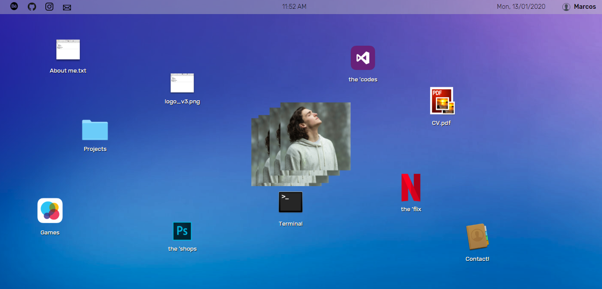
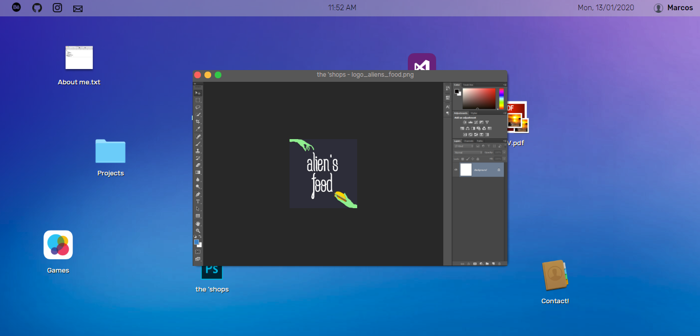
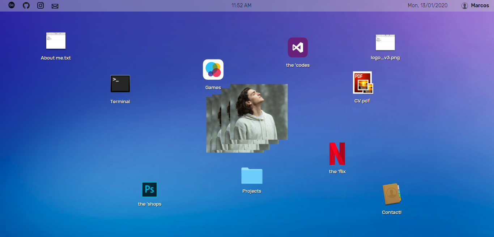

# Experimental desktop-style portfolio (under development - old project)
In this repository, can be found the source code for the experimental portfolio desktop-style, written using HTML, CSS, and Javascript.

